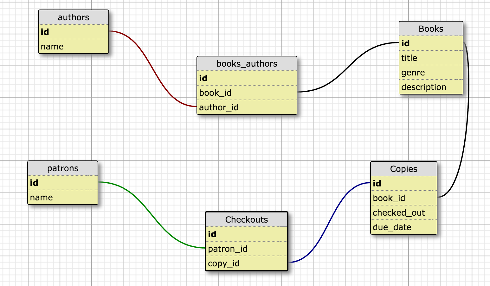

# Library Web App

#### _9-29-16_

#### By _**Seth Kendall &amp; Aimen Khakwani**_

## Description

A web app for library, both for users and librarians. It allows a librarian to add books, update and delete them, as well as add multiple authors for a book and vice versa (many-to-many relationship). An admin can also add copies of a book, and check a list of checked out books. Patrons of a library can 'log-in' (does not remeber log-ins) and check out books, as well as search for books and view them. 

## Database Schema

## Setup/Installation Requirements

* Clone the repository
* Using the command line, navigate to the project's root directory
* Install dependencies by running $ composer install
* Start MySQL by running the command $ /Applications/MAMP/Library/bin/mysql --host=localhost -uroot -proot
* Start Apache by running the command $ apachectl start
* Import the MySQL file from localhost:8080/phpmyadmin/
* Navigate to the /web directory and start a local server with $ php -S localhost:8000
* Open a browser and go to the address http://localhost:8000 to view the application

## Known Bugs

_None so far_

## Support and contact details

_Please contact us through GitHub_

## Technologies Used

_HTML,
CSS,
JS,
PHP,
Silex,
Twig,
PHPUnit,
MySQL_

### License

*This webpage is licensed under the MIT license.*

Copyright (c) 2016 **_Seth Kendall &amp; Aimen Khakwani_**
